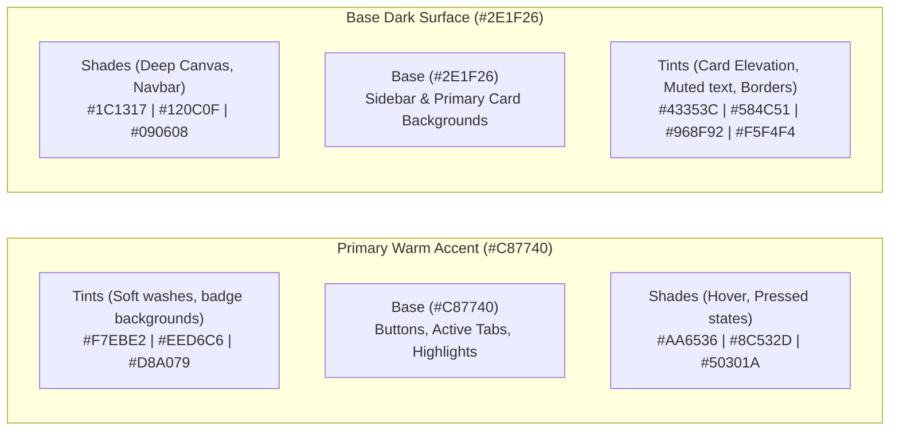

# Implementation Plan: Advocate Diary System Web UI

A modern, responsive, and executive-grade web interface for the Advocate Diary System, enabling legal professionals to manage clients, track court cases, and schedule hearings with zero friction.

---

## User Review Required

> [!IMPORTANT]
> **Extracted Color Palette from Reference Image ([Google Photos Link](https://photos.app.goo.gl/4A4W6TdoWDhWYQgb9))**:
> The image specifies two primary base tones:
> 1. **Primary Warm Accent (`#C87740`)**: "Caramel / Terracotta" – rich warm copper tone used for call-to-actions, active indicators, interactive elements, highlights, and status badges.
> 2. **Base Dark Surface (`#2E1F26`)**: "Raisin / Deep Cocoa" – luxurious dark espresso-plum tone used for sidebar, page canvas, cards, typography, and borders.
>
> We will derive a comprehensive mathematical palette of **Tints** (+white), **Shades** (+black), and **Tones** (+gray) to provide high contrast, legal elegance, and visual hierarchy.

> [!IMPORTANT]
> **Zero Node.js / Zero Build Step Architecture**:
> Node.js/npm is not installed on the system. The frontend will be engineered using modern, modular **HTML5 + CSS3 Custom Properties (variables) + Vanilla ES6 JavaScript**, mounted directly into FastAPI via `starlette.staticfiles.StaticFiles`.
> This means running `uv run uvicorn advocatediarysystem.main:app --reload` will serve both the backend API and the full interactive UI in a single command at `http://127.0.0.1:8000` with zero CORS friction.

---

## 1. Design System & Color Matrix



### Color Token Mapping
- `--bg-canvas`: Deepest Raisin Shade (`#1C1317`) for Dark Executive mode / Soft Parchment (`#F7EBE2`) for Light mode.
- `--bg-surface`: Base Raisin (`#2E1F26`) / White (`#FFFFFF`).
- `--bg-elevated`: Raisin Tint 10% (`#43353C`) / Raisin Tint 95% (`#F5F4F4`).
- `--border-subtle`: Raisin Tint 20% (`#584C51`) with 20% opacity.
- `--color-primary`: Warm Caramel (`#C87740`).
- `--color-primary-hover`: Caramel Shade 15% (`#AA6536`).
- `--color-primary-wash`: Caramel Tint 85% (`#F7EBE2`).
- `--text-primary`: Pure Parchment (`#F7EBE2` in dark mode) / Deep Raisin (`#1C1317` in light mode).
- `--text-muted`: Raisin Tint 70% (`#C0BCBE`) / Raisin Tint 35% (`#776D72`).
- `--status-open`: Amber Caramel (`#C87740`).
- `--status-pending`: Warm Sand Tone (`#D8A079`).
- `--status-closed`: Slate Raisin Tone (`#776D72`).

---

## 2. Core Views & User Interface Features

```mermaid
graph TD
    App[Advocate Diary System UI] --> Dashboard[Dashboard Overview]
    App --> ClientsView[Clients Management]
    App --> CasesView[Cases Management]
    App --> HearingsView[Hearings Diary & Calendar]
    
    Dashboard --> StatCards[KPI Metrics: Active Cases, Upcoming Hearings, Clients]
    Dashboard --> QuickActions[Quick Add: Client / Case / Hearing]
    Dashboard --> UpcomingAgenda[Next 7-Days Hearing Agenda]
    
    ClientsView --> ClientList[Searchable & Paginated Client Grid]
    ClientsView --> ClientModal[Create & Edit Client Modals]
    ClientsView --> ClientCascade[Delete with Cascade Case Warning]
    
    CasesView --> StatusFilter[Status Filters: All, Open, Pending, Closed]
    CasesView --> ClientFilter[Filter by Client Dropdown]
    CasesView --> CaseCards[Case List with Hearing Counter & Direct Link]
    
    HearingsView --> TimelineView[Chronological Hearing Timeline]
    HearingsView --> HearingUpdate[Quick Outcome & Next Adjourned Date Recorder]
```



### Detailed Functional Specifications

1. **Top Navigation & Sidebar**:
   - Sidebar with brand icon (Legal Scales / Diary symbol), Navigation tabs (Dashboard, Clients, Cases, Hearings), API Docs direct link (`/docs`), and Database Status indicator.
   - Quick global search shortcut (`Ctrl+K` / `Cmd+K`) and "+ Quick Create" dropdown.
   - Theme toggle (Dark Executive Raisin vs. Warm Parchment Light).

2. **Dashboard Overview**:
   - Real-time KPI statistics: Total Clients, Total Active Cases, Closed Cases, Upcoming Hearings.
   - Urgent Hearing Alert card: Hearings scheduled within the next 48 hours.
   - Quick Action buttons to log proceedings or add entries in under 10 seconds.

3. **Clients Management**:
   - Instant search by client name, email, or phone.
   - Table and Card view options.
   - View associated cases directly from a client card.
   - Create (`POST /clients/`), Edit (`PATCH /clients/{id}`), Delete (`DELETE /clients/{id}`) with cascade warning modal.

4. **Cases Management**:
   - Filter tabs: `All`, `Open`, `Pending`, `Closed`.
   - Client selector to isolate all matters for a single client.
   - Case details: Case Number, Title, Court, Opposite Party, Status Badge, Creation date, and linked hearings count.
   - Create Case modal (`POST /cases/`) with pre-populated client selector.
   - Edit Case (`PATCH /cases/case/{id}`) and Delete Case (`DELETE /cases/{id}`).

5. **Hearings Diary (Core Legal Workflow)**:
   - Chronological Court Diary listing hearing date, court, case title, stage of proceedings, and notes.
   - "Record Outcome" action: Quickly updates stage (Evidence, Arguments, Bail, Order), writes summary notes, and sets the `next_hearing_date`.
   - Adjournment alert: Flags hearings that do not yet have a next scheduled date.
   - Schedule Hearing modal (`POST /hearings/`).

6. **Interactive System & Feedback**:
   - Beautiful, unobtrusive Toast Notification system for create/update/delete operations.
   - Graceful 404 handling (e.g. automatically converting empty case/hearing endpoints into friendly empty states).
   - Responsive design supporting desktops, tablets, and smartphones.

---

## Proposed Changes

 Grouped by layer and component:

### Static Frontend Assets

#### [NEW] [index.html](file:///home/hp/Programing-Workspace/Projects/AdvocateDiarySystem/src/advocatediarysystem/static/index.html)
- Single-page application skeleton with semantic HTML5 elements.
- Embedded SVG icons (Lucide-style feather legal icons: Scale, Calendar, Briefcase, Users, Plus, Search, CheckCircle).
- Accessible modal dialogs and notification containers.

#### [NEW] [variables.css](file:///home/hp/Programing-Workspace/Projects/AdvocateDiarySystem/src/advocatediarysystem/static/css/variables.css)
- Mathematical tokens for the Caramel (`#C87740`) and Raisin (`#2E1F26`) color family (tints, shades, tones).
- Typography rules (Plus Jakarta Sans & Playfair Display for legal distinction).
- Dark and Light mode theme definitions.

#### [NEW] [style.css](file:///home/hp/Programing-Workspace/Projects/AdvocateDiarySystem/src/advocatediarysystem/static/css/style.css)
- Complete design system: sidebar layout, responsive grid, glassmorphic cards, custom form inputs, modal dialogs, status badges, timeline cards, and toast animations.

#### [NEW] [api.js](file:///home/hp/Programing-Workspace/Projects/AdvocateDiarySystem/src/advocatediarysystem/static/js/api.js)
- Fetch wrapper configured for FastAPI endpoints (`/clients`, `/cases`, `/hearings`).
- Centralized error parsing (handles 404s, Pydantic 422 validation errors, and network errors).

#### [NEW] [state.js](file:///home/hp/Programing-Workspace/Projects/AdvocateDiarySystem/src/advocatediarysystem/static/js/state.js)
- Lightweight reactive state store tracking loaded clients, cases, hearings, active filters, and modal states.

#### [NEW] [ui.js](file:///home/hp/Programing-Workspace/Projects/AdvocateDiarySystem/src/advocatediarysystem/static/js/ui.js)
- DOM rendering logic for Dashboard KPIs, Client table/cards, Case cards with status badges, and Hearing timeline.
- Modal open/close lifecycle, form resets, and toast notification dispatch.

#### [NEW] [app.js](file:///home/hp/Programing-Workspace/Projects/AdvocateDiarySystem/src/advocatediarysystem/static/js/app.js)
- Application initialization, event listeners, form submit handlers, search input debounce, and tab switching.

---

### Backend Integration

#### [MODIFY] [main.py](file:///home/hp/Programing-Workspace/Projects/AdvocateDiarySystem/src/advocatediarysystem/main.py)
- Import `CORSMiddleware` and configure CORS to allow seamless local testing.
- Import `StaticFiles` from `starlette.staticfiles`.
- Move root health check to `/api/health`.
- Mount `StaticFiles(directory=STATIC_DIR, html=True)` at `/` so the website loads seamlessly when visiting `http://127.0.0.1:8000`.

---

## Verification Plan

### Automated Verification
1. Run existing test suite to ensure backend contracts remain 100% intact:
   ```bash
   uv run pytest -v -s
   ```
2. Start the Uvicorn server in background and verify static asset delivery:
   ```bash
   curl -I http://127.0.0.1:8000/
   curl -I http://127.0.0.1:8000/api/health
   curl -I http://127.0.0.1:8000/css/variables.css
   ```

### Manual & Interactive Verification
1. **Dashboard KPI Check**: Confirm client, case, and hearing counts accurately reflect database contents.
2. **Client Flow**:
   - Create a client via UI modal -> Verify client appears in table.
   - Edit client -> Verify change persists.
   - Delete client -> Confirm prompt warning and successful deletion.
3. **Case Flow**:
   - Create a case attached to a client -> Confirm status badge is styled with `#C87740` tint.
   - Filter cases by status (`open`, `pending`, `closed`).
4. **Hearing Flow**:
   - Schedule a hearing -> Confirm it appears on the upcoming diary timeline.
   - Use "Record Outcome" -> Update stage to `Arguments` and set a next adjourned date.
5. **Theme & Palette Verification**:
   - Verify all primary accents and dark backgrounds match the Raisin (`#2E1F26`) and Caramel (`#C87740`) tints, tones, and shades.